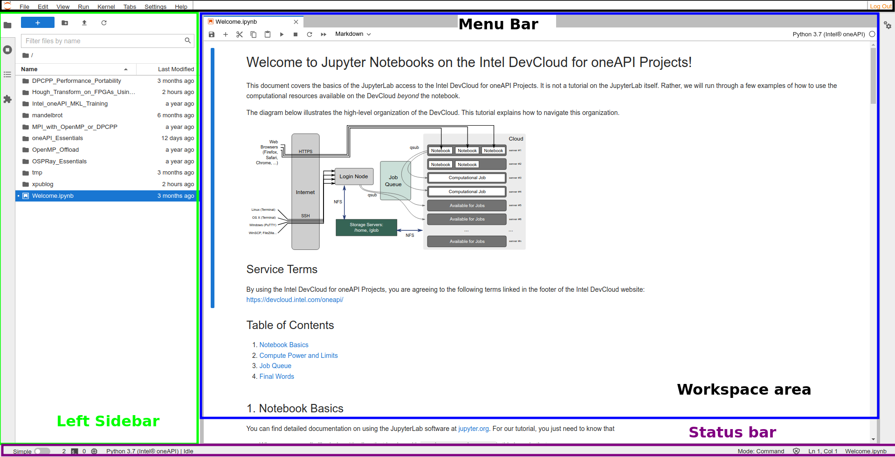

# Cal State LA EE 3445 Course Project

Author: Y. Curtis Wang

This folder should be uploaded to Intel DevCloud's JupyterLab environment.

The easiest way is to first read the directions below, then once on DevCloud, upload/clone.

**NOTE: to view this file with proper formatting, open it via: (right-click README.md -> Open with -> Markdown Preview).**

## Tutorial Format

This tutorial will help you get started on Intel(R) DevCloud, a platform for experimenting with XPUs and cluster computing.

1. Intel(R) DevCloud is a cloud service that allows users to work on XPU-based computers to learn different programming paradigms and prototype projects.

2. JupyterLab is the cloud integrated development environment (IDE) that is offered on DevCloud, facilitating quick prototyping and visualization with primarily Python-based frameworks.

3. A Jupyter Notebook is a type of source code file structured as a collection of cells, that allows for both Markdown and Code cells to be used in the same file.  This allows for presentation of code ideas or results inline with software source code.

## Getting onto JupyterLab on Intel DevCloud for oneAPI

1. Register for an Intel DevCloud for oneAPI account at: https://devcloud.intel.com/oneapi/get_started/
2. Sign into Intel DevCloud for oneAPI at the same link above.
3. Once signed in, scroll down until the link "Launch JupyterLab" is shown.  Click on the "Launch JupyterLab" link to launch JupyterLab.

## Getting acquainted with JupyterLab

_Figure: JupyterLab user interface is shown, with the left sidebar (file explorer, kernel control, and current notebook table of contents), main area (notebooks, text files, notebooks, etc.), menu bar (command palette), and status bar (kernel status, text file lines and columns, etc.)._

JupyterLab is very much like other IDE applications, except it runs inside the browser for users.  Much like most IDEs, JupyterLab can navigate your files, split into tabs (simply just drag the tab around after you open a file), run code, display lines numbers, etc.

To get started, let's first get Line Numbers to show up! 

1. If you do not see "Welcome to Jupyter Notebooks on the Intel DevCloud for oneAPI Projects!" notebook, go ahead and double-click the file *Welcome.ipynb* on the left sidebar to open the Welcome Jupyter Notebook.  The notebook should now appear in the workspace area.
2. Click on the *View* button in the *Menu bar* and select *Show Line Numbers*.
3. As you scroll down in the notebook, you should see code cells (where the text becomes monospaced) where line numbers now appear to the left of code.
4. Work through this notebook, starting from the top, so you get an understanding of Jupyter Notebooks and how to execute programs on the DevCloud system.  Continue to the next section of this tutorial when you have finished the Welcome.ipynb notebook.

Another useful setting is increasing the code and content font sizes.  To do so, go to *Settings* in the *Menu bar*, then the *JupyterLab Theme* submenu, followed by either *Increase Code Font Size* or *Increase Content Font Size*.  Repeat this step until the content and code sizes are to your desiring.

## Getting this folder onto JupyterLab

You can either manually upload every file, or simply hit the Blue + icon (top left), then select "Terminal", then run the following command:

`git clone https://github.com/curtywang/csula-ee3445-final-project/`

Then, hit the little refresh circle button next to the Blue + icon and you will see this folder on DevCloud JupyterLab!

## Getting acquainted with job submission on Intel DevCloud for oneAPI

Now that you are familiar with JupyterLab go ahead and go into the `c1_intro_parallel_computing` folder on the left pane.

Go ahead and proceed with the `c1_a_intro_intel_devcloud.ipynb` notebook, which
is the same notebook as the `Welcome.ipynb` notebook that opens by default on Intel DevCloud's JupyterLab.

## Acknowledgements

This project was supported in part by Intel Corporation through the Intel Mindshare Curriculum grant program.
